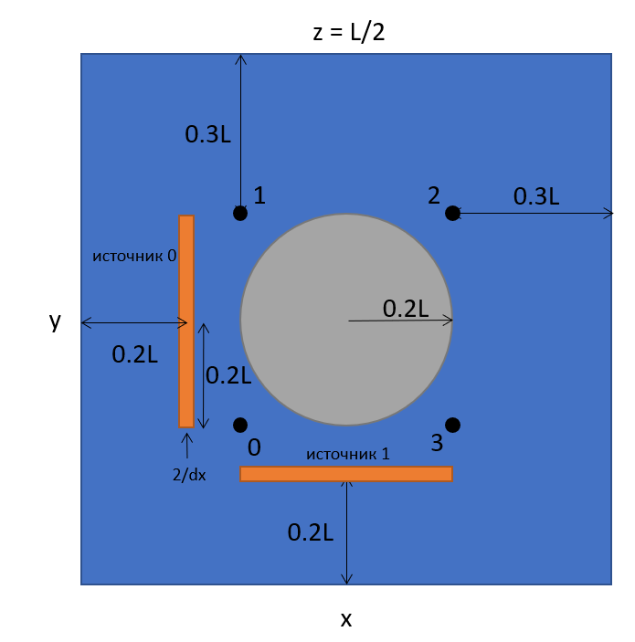

# heat_transfer_problem

### Условие задачи

**Дано:**
- твердое тело, в массе которого распространяется тепло от нескольких источников
- тело - куб $[0, L] x [0, L] x [0, L]$ с коэффициентом диффузии $D = 1.0$
- в центре куба расположен шар радиуса $R = L/5$ с низким коэффициентом диффузии $D_R = 10^{-16}$
- $T_0 = 0$ - начальная температура во всем объеме куба
- граничные условия на гранях куба двух видов:
    - фиксированная температура (0 градусов) на гранях
        - $x = 0$
        - $y = L$
    - абсолютная теплоизоляция на гранях
        - $x = L$
        - $y = 0$ 
        - $z = 0$
        - $z = L$ 
- в массе куба расположены источники тепла, мощность которых меняется по периодическому закону $\dot{q}_i = p_i \cdot (sin(\frac{2\pi}{\theta_i}t + \phi_i) + 1)$

    - пластина 0:
        - центр $(0.2L, 0.5L, 0.5L)$
        - размеры (от центра до края) $(4/dx, 0.2L, 0.2L)$
        - $p_0 = 100$, $\theta_0 = 50$, $\phi_0 = 0$
        
    - пластина 1:
        - центр $(0.5L, 0.2L, 0.5L)$
        - размеры (от центра до края) $(0.2L, 4/dx, 0.2L)$
        - $p_0 = 100$, $\theta_0 = 77$, $\phi_0 = 10$
    
- координаты проб, для которых необходимо построить графики изменения температуры от времени
    - проба 0: $(0.3L, 0.3L, 0.5L)$
    - проба 1: $(0.3L, 0.7L, 0.5L)$
    - проба 2: $(0.7L, 0.7L, 0.5L)$
    - проба 3: $(0.7L, 0.3L, 0.5L)$
    
- $dx$ - шаг пространственного разбиения по всем трем измерениям
- $t_m = 600$ c - общее время моделирования

Рис. 1. Сечение тела плоскостью z=L/2

**Требуется:**
- согласно уравнению диффузии смоделировать распространение тепла в кубе на заданное время $t_m$ при:
    - $L = 100$
    - $(dx, dt) \in [(4, 0.2), (2, 0.1), (1, 0.05), (0.5, 0.025)]$
    
    
- для каждой пары $(dx, dt)$:
    1. вывести время расчета
    
    2. сохранить в файл(ы) и использовать в пунктах 3-5:
        - температурное поле в конечный момент времени
        - замеры температуры в местах установки проб

    3. построить цветовую карту в конечный момент времени в сечении $z = 0.5L$
        - подписать оси,
        - отобразить цветовую шкалу (colorbar),
        - отобразить пробы в виде точек и подписать их номера.

    4. на одном рисунке построить графики температур в местах установки проб
        - подписать оси,
        - вывести легенду.

    5. используя быстрое преобразование Фурье, восстановить периоды колебаний температуры в местах установки проб
        - `np.fft.rfft`, `np.fft.rfftfreq`, `scipy.signal.find_peaks`
    

**Описание:**

Распространение тепла можно описать при помощи уравнения диффузии (уравнение с частными производными):

$\frac{\partial{T}}{\partial{t}} = D \left(\frac{\partial^2{T}}{\partial{x^2}} + \frac{\partial^2{T}}{\partial{y^2}} + \frac{\partial^2{T}}{\partial{z^2}} \right) + \dot{q}$, где

- $T(t, x, y, z)$ - поле температур
- $D(x, y, z)$ - коэффициент диффузии
- $\dot q(t, x, y, z)$ - функция источников тепла

Для решения нестационарной задачи распространения тепла рассматриваемое тело представляют в виде сетки с равномерным шагом, а дифференциальное уравнение заменяют на конечно-разностное. Рассмотрим схему `FTCS`, т.е. производная по времени заменяется на правую разность (Forward Time), а вторая производная по пространственным переменным заменяется на центральную разность (Central Space).

$\frac{\partial{T}}{\partial{t}} \rightarrow \frac{T^{n}\_{i,j,k} - T^{n-1}\_{i,j,k}}{dt}$

$\frac{\partial^2{T}}{\partial{x^2}} \rightarrow \frac{T^{n-1}\_{i-1,j,k} - 2T^{n-1}\_{i,j,k} + T^{n-1}\_{i+1,j,k}}{dx^2}, ...$

$\frac{T^{n}\_{i,j} - T^{n-1}\_{i,j}}{dt} = \frac{D\_{i,j}}{dx^2} \left(T^{n-1}\_{i-1,j,k} + T^{n-1}\_{i+1,j,k} + T^{n-1}\_{i,j-1,k}  + T^{n-1}\_{i,j+1,k} + T^{n-1}\_{i,j,k-1} + T^{n-1}\_{i,j,k+1} - 6T^{n-1}\_{i,j,k}\right) + \dot{q}$

Итоговая рекуррентная формула для вычисления температуры в момент времени $n \cdot dt$ в ячейке сетки $(i, j, k)$ на основании данных в момент времени $(n-1) \cdot dt$:

$T^{n}\_{i,j} = T^{n-1}\_{i,j} + \frac{dt D\_{i,j,k}}{dx^2} \left(T^{n-1}\_{i-1,j,k} + T^{n-1}\_{i+1,j,k} + T^{n-1}\_{i,j-1,k}  + T^{n-1}\_{i,j+1,k} + T^{n-1}\_{i,j,k-1} + T^{n-1}\_{i,j,k+1} - 6T^{n-1}\_{i,j,k}\right) + dt \cdot \dot{q}^{n}\_{i,j,k}$

Временной шаг $dt$ должен быть таким, чтобы учитывать условие Курранта: $dt = \frac{C \cdot dx}{D}$, где $C$ - число Курранта.

В этой задаче рассматриваются граничные условия двух видов - фиксированная температура и абсолютная теплоизоляция. Оба вида граничных условий указаны на гранях куба. Таким образом, расчет распространения тепла выполняется для всех ячеек сетки, за исключением расположенных на гранях куба, т.е. $i, j, k \in (0, N-1)$, где $N = L / dx$.
Граничное условие в виде фиксированной температуры записывается в соответствующие граням куба ячейки сетки. 

Например, для грани $x = 0$: $T^{n}\_{0,j,k} = T\_\*$, грани $x = L$: $T^{n}\_{N-1,j,k} = T\_\*$. 

Граничное условие в виде абсолютной теплоизоляции означает, что через заданную грань нет потока тепла, а это достижимо, если температура в ячейках грани и прилегающим к ним ячейкам одинаковая. 

Например, $x = 0$: $T^{n}\_{0,j,k} = T^{n}\_{1,j,k}$, грани $x = L$: $T^{n}\_{N-1,j,k} = T^{n}\_{N-2,j,k}$.

**Материалы:**

- [Уравнение теплопроводности](https://ru.wikipedia.org/wiki/Уравнение_теплопроводности)
- [Solving 2D heat equation numerically using python](https://levelup.gitconnected.com/solving-2d-heat-equation-numerically-using-python-3334004aa01a)
- [Diffusion Eq 2D with Source](https://www.youtube.com/watch?v=aCRYfvh_bnY)
